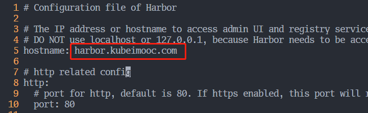
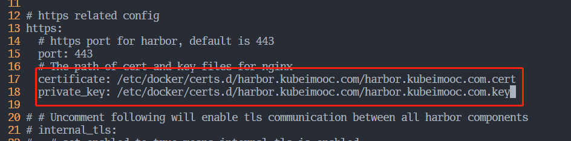
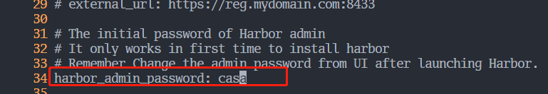
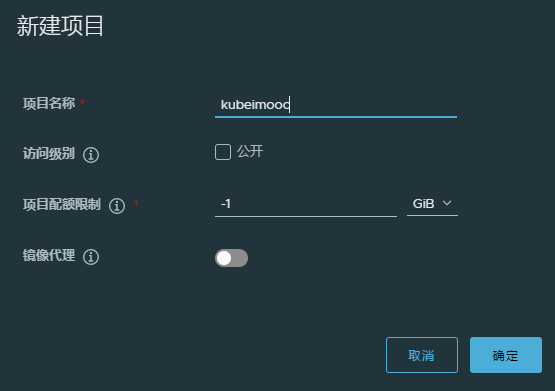
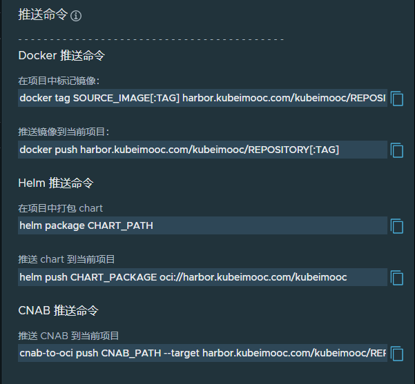
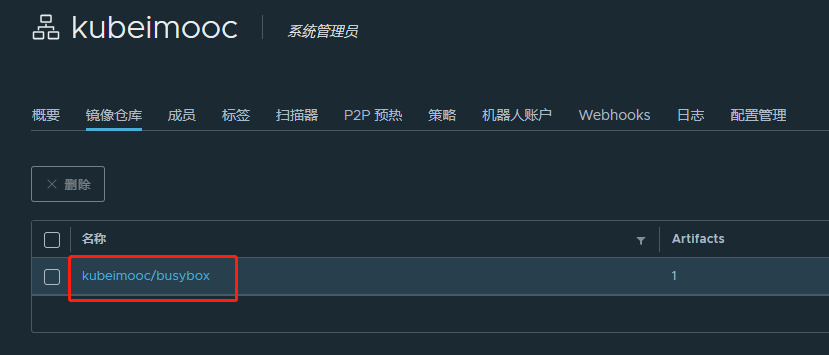

# 1. 环境搭建
## 1.1 虚拟机环境
|    主机    |       IP        |   角色   |
| :--------: | :-------------: | :------: |
| k8s-master | 192.168.159.128 |  master  |
| k8s-node1  | 192.168.159.129 |  node1   |
| k8s-node2  | 192.168.159.130 |  node2   |
|  lgc-dev   | 192.168.159.131 | 开发主机 |
  
- Docker 版本: 24.0.1
- docker-compose 版本: 1.25.0
- k8s 版本: 1.23.7

## 1.2 Harbor 镜像仓库搭建
    
> 参考文档：https://goharbor.io/docs/2.8.0/install-config/  

### 下载 harbor 安装包
利用离线安装的方式
```
wget https://github.com/goharbor/harbor/releases/download/v2.8.1/harbor-offline-installer-v2.8.1.tgz  
tar -xzvf harbor-offline-installer-v2.8.1.tgz
```

### 配置 https   
```shell
mkdir certs
cd certs
# 创建 gen_certs.sh 并加入以下内容
# Generate a Certificate Authority Certificate
openssl genrsa -out ca.key 4096
openssl req -x509 -new -nodes -sha512 -days 3650 \
 -subj "/C=CN/ST=Beijing/L=Beijing/O=example/OU=Personal/CN=harbor.kubeimooc.com" \
 -key ca.key \
 -out ca.crt

# Generate a Server Certificate
openssl genrsa -out harbor.kubeimooc.com.key 4096
openssl req -sha512 -new \
    -subj "/C=CN/ST=Beijing/L=Beijing/O=example/OU=Personal/CN=harbor.kubeimooc.com" \
    -key harbor.kubeimooc.com.key \
    -out harbor.kubeimooc.com.csr

cat > v3.ext <<-EOF
authorityKeyIdentifier=keyid,issuer
basicConstraints=CA:FALSE
keyUsage = digitalSignature, nonRepudiation, keyEncipherment, dataEncipherment
extendedKeyUsage = serverAuth
subjectAltName = @alt_names

[alt_names]
DNS.1=harbor.kubeimooc.com
DNS.2=yourdomain
DNS.3=hostname
EOF

openssl x509 -req -sha512 -days 3650 \
    -extfile v3.ext \
    -CA ca.crt -CAkey ca.key -CAcreateserial \
    -in harbor.kubeimooc.com.csr \
    -out harbor.kubeimooc.com.crt

mkdir -p /data/cert
cp harbor.kubeimooc.com.crt /data/cert/
cp harbor.kubeimooc.com.key /data/cert/

openssl x509 -inform PEM -in harbor.kubeimooc.com.crt -out harbor.kubeimooc.com.cert
mkdir -p /etc/docker/certs.d/harbor.kubeimooc.com/
cp harbor.kubeimooc.com.cert /etc/docker/certs.d/harbor.kubeimooc.com/
cp harbor.kubeimooc.com.key /etc/docker/certs.d/harbor.kubeimooc.com/
cp ca.crt /etc/docker/certs.d/harbor.kubeimooc.com/
systemctl restart docker

# 接下来生成证书
chmod +x gen_certs.sh 
./gen_certs.sh
ls /etc/docker/certs.d 
```

### 启动 harbor  
将下载的离线安装包解压好后进入目录
```shell
cd harbor
```
先将harbor.yml.tmpl拷贝为harbor.yml，然后修改harbor.yml的内容   
**修改hostname**   
   
  
**修改证书位置**  
    
   
**修改登录密码**  


**启动**  
```shell
./install.sh
# 查看是否启动成功，如果想关闭可以用docker-compose down -v
docker-compose ps

# 将以下内容加入到/etc/hosts文件中, 其它虚拟机和Windows的hosts文件也可以加
192.168.159.131 harbor.kubeimooc.com

# 然后登录, 账号密码是 admin/casa
# 注意在其它虚拟机登录时一定要先拷贝证书
cd /etc/docker
sudo scp -r root@192.168.159.131:/etc/docker/certs.d .
docker login harbor.kubeimooc.com

# 也可以使用浏览器登录, 但需要先关闭代理
```
   
**上传镜像**   
先创建一个镜像仓库  
 
     
然后可以查看到相关的推送命令      

   
```shell
docker pull busybox
docker tag busybox:latest harbor.kubeimooc.com/kubeimooc/busybox:latest
docker push harbor.kubeimooc.com/kubeimooc/busybox:latest
```
  
**推送成功**  
  

## 1.3 golang 后端项目搭建  
### 开发环境
- golang 版本: go version go1.19.7 linux/amd64
- 编译环境: Linux
- 开发工具: vscode

### 项目初始化  
```shell
go get -u github.com/gin-gonic/gin@v1.8.1
go get -u github.com/spf13/viper@v1.13.0
go get k8s.io/client-go@v0.23.7
```
**项目目录如下**：
```shell
├── api
│   ├── example
│   └── k8s
├── config
├── convert
│   └── pod
├── doc
│   └── assets
├── global
├── initialize
├── model
│   └── pod
│       ├── request
│       └── response
├── response
├── router
│   ├── example
│   └── k8s
└── service
    └── pod
```
**运行测试**：
```shell
go run main.go
curl http://192.168.159.131:8082/example/ping
curl http://192.168.159.131:8082/k8s/pod/kube-system
```
给代码打 tag 
```shell
git tag -a v1.0 -m "kubeimooc 项目后端初始化"
```

## 1.4 vue 前端项目搭建   
### 安装nodejs  
```shell
curl -fsSL https://deb.nodesource.com/setup_16.x | sudo -E bash -
sudo apt-get install -y nodejs
node -v
sudo apt update
sudo apt install -y python3-pip
pip3 install --upgrade pip
pip3 --version
```
### clone项目
```shell
git clone https://github.com/PanJiaChen/vue-admin-template.git
mv vue-admin-template kubeimooc-web
```
### 下载依赖
```shell
npm install --registry=https://registry.npm.taobao.org
```
### 删除部分代码
- rsc/router/index.js  
  example 之后的路由都不要，example只要一个子路由    
- 关闭登录   
  src/permission.js， 直接Next()
- 关闭eslint  
  (1) vue.config 关闭lintOnSave, 即改为false  
  (2) node_modules 找到 webpack 的 package.json, 修改以下内容  
  - 删除husky
  - lint.stated 下数组设为空   
  
  (3) eslintignore 全部设为*   
  (4) exlintrc.js extends 去除数组的最后一个元素  

### 运行
```shell
sudo sysctl -w fs.inotify.max_user_watches=524288
npm run dev
```