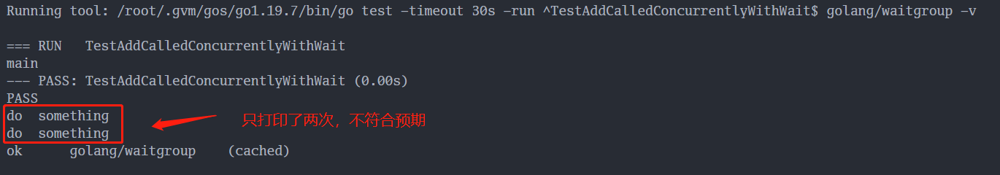

# 1. 前言
Go语言中的 WaitGroup 可以进行任务编排，比如我们有一个主任务在执行，执行到某一点时需要并行执行三个子任务，并且需要等到三个子任务都执行完后，再继续执行主任务。那我们就需要设置一个检查点，使主任务一直阻塞在这，等三个子任务执行完后再放行。
# 2. 基本使用
我们先来个简单的例子，看下 WaitGroup 是怎么使用的。示例中使用 Add(5) 表示我们有 5个 子任务，然后起了 5个 协程去完成任务，主协程使用 Wait() 方法等待 子协程执行完毕，输出一共等待的时间。     
[点击查看源码](./001_base_use_test.go)
```go
func TestBaseUse(t *testing.T) {
	var wg sync.WaitGroup

	start := time.Now()
	wg.Add(5) // 表示有5个goroutine需要等待
	for i := 0; i < 5; i++ {
		go func(i int) {
			defer wg.Done() // goroutine 退出时调用Done表示该写出已结束
			time.Sleep(time.Second)
			fmt.Printf("%d done\n", i)
		}(i)
	}

	wg.Wait()
	fmt.Println(time.Since(start).Seconds())
}
```
# 3. 原理分析
## 3.1 总览
WaitGroup 一共有三个方法：
```go
(wg *WaitGroup) Add(delta int)
(wg *WaitGroup) Done()
(wg *WaitGroup) Wait()
```
- Add 方法用于设置 WaitGroup 的计数值，可以理解为子任务的数量
- Done 方法用于将 WaitGroup 的计数值减一，可以理解为完成一个子任务
- Wait 方法用于阻塞调用者，直到 WaitGroup 的计数值为0，即所有子任务都完成  

正常来说，我们使用的时候，需要先确定子任务的数量，然后调用 Add() 方法传入相应的数量，在每个子任务的协程中，调用 Done()，需要等待的协程调用 Wait() 方法，状态流转如下图：

## 3.2 底层实现
> 以下涉及到的源码是基于Go1.19分析
### 3.2.1 WaitGroup 的结构
```go
type WaitGroup struct {
	noCopy noCopy

	// 64-bit value: high 32 bits are counter, low 32 bits are waiter count.
	// 64-bit atomic operations require 64-bit alignment, but 32-bit
	// compilers only guarantee that 64-bit fields are 32-bit aligned.
	// For this reason on 32 bit architectures we need to check in state()
	// if state1 is aligned or not, and dynamically "swap" the field order if
	// needed.
	state1 uint64
	state2 uint32
}
```
其中 `noCopy` 是 golang 源码中检测禁止拷贝的技术。如果程序中有 WaitGroup 的赋值行为，使用 `go vet` 检查程序时，就会发现有报错。但需要注意的是，noCopy 不会影响程序正常的编译和运行。   
`state1`字段
- 高32位为counter，代表目前尚未完成的协程个数
- 低32位为waiter，代表目前已调用 Wait 的 goroutine 的个数，因为wait可以被多个协程调用   

`state2`为信号量, WaitGroup 的整个调用过程可以简单地描述成下面这样：
- 当调用 WaitGroup.Add(n) 时，counter 将会自增: counter + n
- 当调用 WaitGroup.Wait() 时，会将 waiter++。同时调用 runtime_Semacquire(semap), 增加信号量，并挂起当前 goroutine
- 当调用 WaitGroup.Done() 时，将会 counter--。如果自减后的 counter 等于 0，说明 WaitGroup 的等待过程已经结束，则需要调用 runtime_Semrelease 释放信号量，唤醒正在 WaitGroup.Wait 的 goroutine, 释放的个数就是waiter的数量  

### 3.2.2 内存对齐
```go
// state returns pointers to the state and sema fields stored within wg.state*.
func (wg *WaitGroup) state() (statep *uint64, semap *uint32) {
	if unsafe.Alignof(wg.state1) == 8 || uintptr(unsafe.Pointer(&wg.state1))%8 == 0 {
		// state1 is 64-bit aligned: nothing to do.
		return &wg.state1, &wg.state2
	} else {
		// state1 is 32-bit aligned but not 64-bit aligned: this means that
		// (&state1)+4 is 64-bit aligned.
		state := (*[3]uint32)(unsafe.Pointer(&wg.state1))
		return (*uint64)(unsafe.Pointer(&state[1])), &state[0]
	}
}
```
Go语言中对于64位的变量进行原子操作，需要保证该变量是 64位对齐 的，也就是要保证这 8个字节 的首地址是 8 的整数倍。因此当 state1 的首地址是 8 的整数倍时，取前8个字节作为 statep ，后4个字节作为 semap；   
   
当 state1 的首地址不是 8 的整数倍时，取后8个字节作为 statep ，前4个字节作为 semap(因为前4个字节的首地址加上4个字节后是8的整数倍)。   
   
为什么会有这种奇怪的设定呢？这里涉及两个前提:
- 在 WaitGroup 的真实逻辑中， counter 和 waiter 被合在了一起，当成一个 64 位的整数对外使用。当需要变化 counter 和 waiter 的值的时候，也是通过 atomic 来原子操作这个 64 位整数   
- 在 32 位系统下，如果使用 atomic 对 64 位变量进行原子操作，调用者需要自行保证变量的 64 位对齐，否则将会出现异常。golang 的官方文档 sync/atomic/#pkg-note-BUG 原文是这么说的
  > On ARM, x86-32, and 32-bit MIPS, it is the caller’s responsibility to arrange for 64-bit alignment of 64-bit words accessed atomically. The first word in a variable or in an allocated struct, array, or slice can be relied upon to be 64-bit aligned.    

因此，在前提 1 的情况下，WaitGroup 需要对 64 位进行原子操作。根据前提 2，WaitGroup 需要自行保证 count+waiter 的 64 位对齐。这个方法非常的巧妙，只不过是改变 semap 的位置顺序，就既可以保证 counter+waiter 一定会 64 位对齐，也可以保证内存的高效利用。WaitGroup 直接把 counter 和 waiter 看成了一个统一的 64 位变量。其中 counter 是这个变量的高 32 位，waiter 是这个变量的低 32 位。 在需要改变 counter 时, 通过将累加值左移 32 位的方式。

### 3.2.3 Add
```go
// 为理解方便，去掉了调试相关的代码
func (wg *WaitGroup) Add(delta int) {
	// wg.state()返回的是地址
	statep, semap := wg.state()

	// 原子操作，修改statep高32位的值，即counter的值
	state := atomic.AddUint64(statep, uint64(delta)<<32)

	// 右移32位，使高32位变成了低32，得到counter的值
	v := int32(state >> 32)

	// 直接取低32位，得到waiter的值
	w := uint32(state)

	// 不规范的操作, 使counter的数量小于0
	if v < 0 {
		panic("sync: negative WaitGroup counter")
	}

	// 不规范操作, Wait和Add并发调用
	if w != 0 && delta > 0 && v == int32(delta) {
		panic("sync: WaitGroup misuse: Add called concurrently with Wait")
	}

	// v>0 : 计数值不等于0，不需要唤醒等待者，直接返回
	// w==0: 没有等待者，不需要唤醒，直接返回
	if v > 0 || w == 0 {
		return
	}

	// 再次检查数据是否一致
	if *statep != state {
		panic("sync: WaitGroup misuse: Add called concurrently with Wait")
	}

	// 到这里说明计数值为0，且等待者大于0，需要唤醒所有的等待者，并把系统置为初始状态（0状态）
	*statep = 0
	for ; w != 0; w-- {
		runtime_Semrelease(semap, false, 0)
	}
}
```
Add 方法主要操作的是 state 的计数部分。你可以为计数值增加一个 delta 值，内部通过原子操作把这个值加到计数值上。需要注意的是，这个 delta 也可以是个负数，相当于为计数值减去一个值，Done 方法内部其实就是通过Add(-1) 实现的。
### 3.2.4 Done
```go
func (wg *WaitGroup) Done() {
	wg.Add(-1)
}
```

### 3.2.5 Wait
```go
// 为理解方便，去掉了调试相关的代码
func (wg *WaitGroup) Wait() {
	statep, semap := wg.state()

	for {
		state := atomic.LoadUint64(statep)
		v := int32(state >> 32)
		w := uint32(state)

		// 计数值数量为0，直接返回，无需等待
		if v == 0 {
			return
		}

		// 到这里说明计数值数量大于0
		// 增加等待者数量：这里会有竞争，比如多个 Wait 调用，或者在同时调用 Add 方法，增加不成功会继续 for 循环
		if atomic.CompareAndSwapUint64(statep, state, state+1) {
			runtime_Semacquire(semap)
			if *statep != 0 {
				panic("sync: WaitGroup is reused before previous Wait has returned")
			}

			return
		}
	}
}
```
Wait 方法的实现逻辑是：不断检查 state 的值。如果其中的计数值变为了 0，那么说明所有的任务已完成，调用者不必再等待，直接返回。如果计数值大于 0，说明此时还有任务没完成，那么调用者就变成了等待者，需要加入 waiter 队列，并且阻塞住自己。

## 3.3 小结
WaitGroup 的原理就五个点：内存对齐，原子操作，counter，waiter，信号量。   
- 内存对齐的作用是为了原子操作。 
- counter的增减使用原子操作，counter的作用是一旦为0就释放全部信号量。
- waiter的自增使用原子操作，waiter的作用是表明要释放多少信号量。

# 4. 易错点
上面分析源码可以看到几个会产生 panic 的点，这也是我们使用 WaitGroup 需要注意的地方。
## 4.1 计数器设置为负值
- 调用 Add 时参数值传负数   
  [点击查看源码](./002_call_add_use_negative_test.go)
  ```go
	func TestCallAddUseNegative(t *testing.T) {
		var wg sync.WaitGroup
		wg.Add(1)
		wg.Add(-1)
		wg.Add(-1)
	}
  ```   
    
- 多次调用 Done 方法  
  [点击查看源码](./003_call_done_muti_times_test.go)
  ```go
  func TestCallDoneMutiTimes(t *testing.T) {
	var wg sync.WaitGroup

	wg.Add(1)
	go func() {
		fmt.Println("test")
		wg.Done()
		wg.Done()
	}()

	time.Sleep(time.Second)
	wg.Wait()
  }
  ```  
## 4.2 Add 和 Wait 并发调用
Add 和 Wait 并发调用，有可能达不到我们预期的效果，甚至 panic。如下示例中，我们想要等待 3 个子任务都执行完后再执行主任务，但实际情况可能是子任务还没起来，主任务就继续往下执行了。   
[点击查看源码](./004_add_called_concurrently_with_wait_test.go)
```go
func doSomething(wg *sync.WaitGroup) {
	wg.Add(1)
	fmt.Println("do  something")
	defer wg.Done()
}

func TestAddCalledConcurrentlyWithWait(t *testing.T) {
	var wg sync.WaitGroup
	for i := 0; i < 3; i++ {
		go doSomething(&wg)
	}

	wg.Wait()
	fmt.Println("main")
}
```  
    
正确的使用方式，应该是在调用 Wait 前先调用 Add  
[点击查看源码](./004_add_called_concurrently_with_wait_test.go)   
```go   
func doSomething2(wg *sync.WaitGroup) {
	defer wg.Done()
	fmt.Println("do  something")
}

func TestAddBeforeWait(t *testing.T) {
	var wg sync.WaitGroup
	wg.Add(3)
	for i := 0; i < 3; i++ {
		go doSomething2(&wg)
	}

	wg.Wait()
	fmt.Println("main")
}
```   
  

## 4.3 没有等 Wait 返回，就重用 WaitGroup
```go
func TestUseWaAgain(t *testing.T) {
	var wg sync.WaitGroup

	wg.Add(1)
	go func() {
		fmt.Println("do something")
		wg.Done()
		wg.Add(1)
	}()

	wg.Wait()
}
```
  

## 4.4 复制使用
Go 语言中的参数传递，都是值传递，就会产生复制操作。因此在向函数传递 WaitGroup 时，使用指针进行操作。   
[点击查看源码](./007_copy_wg_test.go)   
```go
func TestCopyWg(t *testing.T) {
	var wg sync.WaitGroup
	wg.Add(3)
	for i := 0; i < 3; i++ {
		// 这里没使用指针，wg状态一直不会改变，导致 Wait 一直阻塞
		go func(wg sync.WaitGroup) {
			fmt.Println("do  something")
			defer wg.Done()
		}(wg)
	}

	wg.Wait()
	fmt.Println("main")
}
```