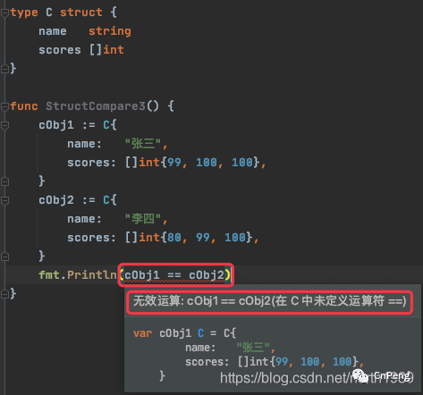
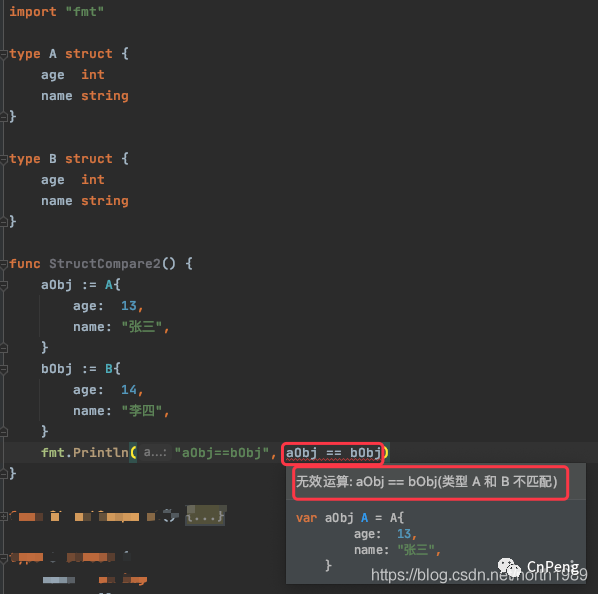
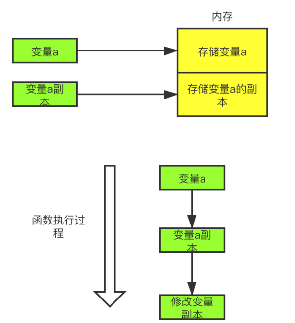
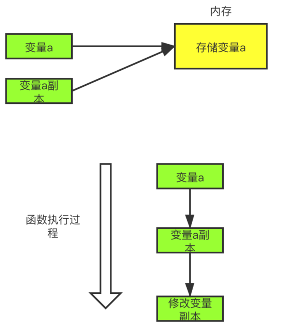
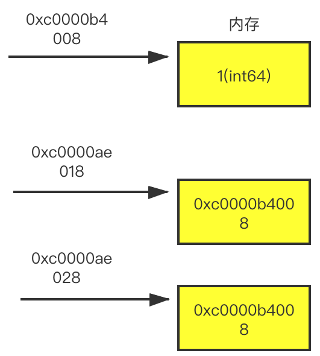
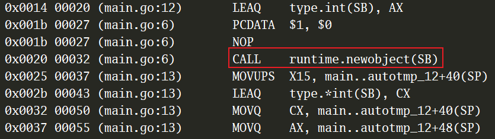

# 1. 通用基础
## 1.1 go struct 能不能用等号做比较
**答案**  
（1）不同类型的 struct 之间不能进行比较，编译期就会报错（GoLand 会直接提示）  
（2）同类型的 struct 也分为两种情况  
  - struct 的所有成员都是可以比较的，则该 strcut 的不同实例可以比较  
  - struct 中含有不可比较的成员（如 Slice，map，函数类型），则该 struct 不可以比较  

**案例分析**  
(1) 相同类型的struct做比较  
```go
import "fmt"

type A struct {
	age  int
	name string
}

func StructCompare1() {
	aObj1 := A{
		age:  13,
		name: "张三",
	}
	aObj2 := A{
		age:  13,
		name: "张三",
	}
	fmt.Println(aObj1 == aObj2) // true

	aObj3 := &A{
		age:  13,
		name: "张三",
	}
	aObj4 := &A{
		age:  13,
		name: "张三",
	}

	fmt.Println(aObj3 == aObj4) // false

	var aObj5 A
	fmt.Println(aObj5) //{0 } ，未明确初始化时，struct 实例的成员取各自的零值
	//fmt.Println( aObj5 == nil)  // 报错，无法将 nil 转换为类型 A

	var aObj6 *A
	fmt.Println(aObj6)        // <nil> ，指针类型数据的零值为 nil
	fmt.Println(aObj6 == nil) //  true，指针类型的数据可以和 nil 比较
}
```
假如 struct 中包含了不可比较的类型，Goland会直接报错   
  
(2) 不同类型的 struct 做比较   
Goland会直接报错  
   

## 1.2 new 和 make 有什么区别
**答案**  
(1) make 和 new 都是用来分配内存的。make 既分配内存也初始化内存；而 new 只是将内存清零，并没有初始化内存   
(2) make 只能用来分配及初始化 slice，map，channel 等数据类型；而new 可以分配任意类型的数据    
(3) make 返回的是引用类型本身；而 new 返回的是指向类型的指针   
   
**使用 new 分配内存**  
- 基础类型 int    
  ```go
  var v * int
  fmt.Println(*v) // 这步会因为空指针而panic
  fmt.Println(v) // <nil>

  v = new(int)
  fmt.Println(*v) // 0
  fmt.Println(v) // 0xc00004c088
  ```
  由此可以看出，初始化一个指针变量，其值为 nil， nil 值是不能直接赋值的。通过 new 返回一个指向新分配类型为 int 的指针，指针值为 0xc00004c088，这个指针值指向的内容的值为0 (zero value)。
- 复合类型-array   
  ```go
  var v * int
  fmt.Println(*v) // 这步会因为空指针而panic
  fmt.Println(v) // <nil>

  v = new(int)
  fmt.Println(*v) // 0
  fmt.Println(v) // 0xc00004c088
  ``` 
- 

**使用 make 分配内存**    
```go
av := make([]int, 5)
fmt.Printf("av: %p %#v \n", &av, av) //av: 0xc000046400 []int{0, 0, 0, 0, 0}
av[0] = 1
fmt.Printf("av: %p %#v \n", &av, av) //av: 0xc000046400 []int{1, 0, 0, 0, 0}

mv := make(map[string]string)
fmt.Printf("mv: %p %#v \n", &mv, mv) //mv: 0xc000074020 map[string]string{}
mv["m"] = "m"
fmt.Printf("mv: %p %#v \n", &mv, mv) //mv: 0xc000074020 map[string]string{"m":"m"}

chv := make(chan string)
fmt.Printf("chv: %p %#v \n", &chv, chv) //chv: 0xc000074028 (chan string)(0xc00003e060)
go func(message string) {
   chv <- message // 存消息
}("Ping!")
fmt.Println(<-chv) // 取消息 //"Ping!"
close(chv)
```
通过上面的例子可以看到，make不仅可以开辟一个内存，还能给这个内存的类型初始化其零值    

## 1.3 go 的参数传递是值传递还是引用传递
**答案**  
(1) Go 中所有的参数传递都是值传递，拷贝的都是一个副本  
(2) 值传递时要么是该值的副本，要么是指针的副本(比如指向切片的底层数组指针的副本)    

### 1.3.1 什么是值传递   
值传递，我们分析其字面意思：传递的就是值。传值的意思是：函数传递的总是原来这个东西的一个副本，一副拷贝。比如我们传递一个int类型的参数，传递的其实是这个参数的一个副本；传递一个指针类型的参数，其实传递的是这个该指针的一份拷贝，而不是这个指针指向的值。我们画个图来解释一下：  
    

### 1.3.2 什么是引用传递    
学习过其他语言的同学，对这个引用传递应该很熟悉，比如C++使用者，在C++中，函数参数的传递方式有引用传递。所谓引用传递是指在调用函数时将实际参数的地址传递到函数中，那么在函数中对参数所进行的修改，将影响到实际参数。   
   
     
### 1.3.3 golang 是值传递  
我们先写一个简单的例子验证一下：   
```go
func main()  {
 var args int64= 1
 modifiedNumber(args) // args就是实际参数
 fmt.Printf("实际参数的地址 %p\n", &args)
 fmt.Printf("改动后的值是  %d\n",args)
}

func modifiedNumber(args int64)  { //这里定义的args就是形式参数
    fmt.Printf("形参地址 %p \n",&args)
    args = 10
}
```
运行结果：    
```go
形参地址 0xc0000b4010 
实际参数的地址 0xc0000b4008
改动后的值是  1
```   
这里正好验证了go是值传递，但是还不能完全确定go就只有值传递，我们再写一个例子验证一下：     
```go
func main()  {
 var args int64= 1
 addr := &args
 fmt.Printf("原始指针的内存地址是 %p\n", addr)
 fmt.Printf("指针变量addr存放的地址 %p\n", &addr)
 modifiedNumber(addr) // args就是实际参数
 fmt.Printf("改动后的值是  %d\n",args)
}

func modifiedNumber(addr *int64)  { //这里定义的args就是形式参数
    fmt.Printf("形参地址 %p \n",&addr)
    *addr = 10
}
```
运行结果：  
```shell
原始指针的内存地址是 0xc0000b4008
指针变量addr存放的地址 0xc0000ae018
形参地址 0xc0000ae028 
改动后的值是  10
``` 
所以通过输出我们可以看到，这是一个指针的拷贝，因为存放这两个指针的内存地址是不同的，虽然指针的值相同，但是是两个不同的指针。    
   
     
通过上面的图，我们可以更好的理解。我们声明了一个变量args，其值为1，并且他的内存存放地址是0xc0000b4008，通过这个地址，我们就可以找到变量args，这个地址也就是变量args的指针addr。指针addr也是一个指针类型的变量，它也需要内存存放它，它的内存地址是多少呢？是0xc0000ae018。 在我们传递指针变量addr给modifiedNumber函数的时候，是该指针变量的拷贝,所以新拷贝的指针变量addr，它的内存地址已经变了，是新的0xc0000ae028。所以，不管是0xc0000ae018还是0xc0000ae028，我们都可以称之为指针的指针，他们指向同一个指针0xc0000b4008，这个0xc0000b4008又指向变量args,这也就是为什么我们可以修改变量args的值。
通过上面的分析，我们就可以确定go就是值传递，因为我们在modifieNumber方法中打印出来的内存地址发生了改变，所以不是引用传递。   

### 1.3.4 引用类型也是值传递吗？  
slice也是值传递吗？  
      
```go
func main()  {
 var args =  []int64{1,2,3}
 fmt.Printf("切片args的地址： %p\n",args)
 modifiedNumber(args)
 fmt.Println(args)
}

func modifiedNumber(args []int64)  {
    fmt.Printf("形参切片的地址 %p \n",args)
    args[0] = 10
}
```   
运行结果：   
 
```shell
切片args的地址： 0xc0000b8000
形参切片的地址 0xc0000b8000 
[10 2 3]   
```
这怎么地址都是一样的呢？并且值还被修改了呢？怎么回事，作何解释，继续来看这个问题。这里我们没有使用&符号取地址符转换，就把slice地址打印出来了，我们在加上一行代码测试一下：  
   
```go
func main()  {
 var args =  []int64{1,2,3}
 fmt.Printf("切片args的地址： %p \n",args)
 fmt.Printf("切片args第一个元素的地址： %p \n",&args[0])
 fmt.Printf("直接对切片args取地址%v \n",&args)
 modifiedNumber(args)
 fmt.Println(args)
}

func modifiedNumber(args []int64)  {
    fmt.Printf("形参切片的地址 %p \n",args)
    fmt.Printf("形参切片args第一个元素的地址： %p \n",&args[0])
    fmt.Printf("直接对形参切片args取地址%v \n",&args)
    args[0] = 10
}
```
运行结果：  

```shell
切片args的地址： 0xc000016140 
切片args第一个元素的地址： 0xc000016140 
直接对切片args取地址&[1 2 3] 
形参切片的地址 0xc000016140 
形参切片args第一个元素的地址： 0xc000016140 
直接对形参切片args取地址&[1 2 3] 
[10 2 3]
```   
通过这个例子我们可以看到，使用&操作符表示slice的地址是无效的，而且使用%p输出的内存地址与slice的第一个元素的地址是一样的，那么为什么会出现这样的情况呢？会不会是fmt.Printf函数做了什么特殊处理？我们来看一下其源码：   
  
```go
fmt包,print.go中的printValue这个方法,截取重点部分，因为`slice`也是引用类型，所以会进入这个`case`：
case reflect.Ptr:
        // pointer to array or slice or struct? ok at top level
        // but not embedded (avoid loops)
        if depth == 0 && f.Pointer() != 0 {
            switch a := f.Elem(); a.Kind() {
            case reflect.Array, reflect.Slice, reflect.Struct, reflect.Map:
                p.buf.writeByte('&')
                p.printValue(a, verb, depth+1)
                return
            }
        }
        fallthrough
    case reflect.Chan, reflect.Func, reflect.UnsafePointer:
        p.fmtPointer(f, verb)
```
p.buf.writeByte('&')这行代码就是为什么我们使用&打印地址输出结果前面带有&的原因。因为我们要打印的是一个slice类型，就会调用p.printValue(a, verb, depth+1)递归获取切片中的内容，为什么打印出来的切片中还会有[]包围呢，我来看一下printValue这个方法的源代码：   

```go
func (p *pp) fmtPointer(value reflect.Value, verb rune) {
    var u uintptr
    switch value.Kind() {
    case reflect.Chan, reflect.Func, reflect.Map, reflect.Ptr, reflect.Slice, reflect.UnsafePointer:
        u = value.Pointer()
    default:
        p.badVerb(verb)
        return
    }
...... 省略部分代码
// If v's Kind is Slice, the returned pointer is to the first
// element of the slice. If the slice is nil the returned value
// is 0.  If the slice is empty but non-nil the return value is non-zero.
 func (v Value) Pointer() uintptr {
    // TODO: deprecate
    k := v.kind()
    switch k {
    case Chan, Map, Ptr, UnsafePointer:
        return uintptr(v.pointer())
    case Func:
        if v.flag&flagMethod != 0 {
 ....... 省略部分代码
```
这里我们可以看到上面有这样一句注释：If v's Kind is Slice, the returned pointer is to the first。翻译成中文就是如果是slice类型，返回slice这个结构里的第一个元素的地址。这里正好解释上面为什么fmt.Printf("切片args的地址： %p \\n",args)和fmt.Printf("形参切片的地址 %p \\n",args)打印出来的地址是一样的，因为args是引用类型，所以他们都返回slice这个结构里的第一个元素的地址，为什么这两个slice结构里的第一个元素的地址一样呢，这就要在说一说slice的底层结构了。
我们看一下slice底层结构：  

``` go
//runtime/slice.go
type slice struct {
    array unsafe.Pointer
    len   int
    cap   int
}
```   
slice是一个结构体，他的第一个元素是一个指针类型，这个指针指向的是底层数组的第一个元素。所以当是slice类型的时候，fmt.Printf返回是slice这个结构体里第一个元素的地址。说到底，又转变成了指针处理，只不过这个指针是slice中第一个元素的内存地址。
说了这么多，最后再做一个总结吧，为什么slice也是值传递。之所以对于引用类型的传递可以修改原内容的数据，这是因为在底层默认使用该引用类型的指针进行传递，但也是使用指针的副本，依旧是值传递。所以slice传递的就是第一个元素的指针的副本，因为fmt.printf缘故造成了打印的地址一样，给人一种混淆的感觉。   

**map也是值传递吗？**    
map和slice一样都具有迷惑行为。map我们可以通过方法修改它的内容，并且它没有明显的指针。比如这个例子：  

```go
func main()  {
    persons:=make(map[string]int)
    persons["asong"]=8

    addr:=&persons

    fmt.Printf("原始map的内存地址是：%p\n",addr)
    modifiedAge(persons)
    fmt.Println("map值被修改了，新值为:",persons)
}

func modifiedAge(person map[string]int)  {
    fmt.Printf("函数里接收到map的内存地址是：%p\n",&person)
    person["asong"]=9
}
```   
   
运行结果：  

```shell
原始map的内存地址是：0xc00000e028
函数里接收到map的内存地址是：0xc00000e038
map值被修改了，新值为: map[asong:9]
```

先喵一眼，哎呀，实参与形参地址不一样，应该是值传递无疑了，等等。。。。map值怎么被修改了？一脸疑惑。。。。。

为了解决我们的疑惑，我们从源码入手，看一看什么原理：  

```go
//src/runtime/map.go
// makemap implements Go map creation for make(map[k]v, hint).
// If the compiler has determined that the map or the first bucket
// can be created on the stack, h and/or bucket may be non-nil.
// If h != nil, the map can be created directly in h.
// If h.buckets != nil, bucket pointed to can be used as the first bucket.
func makemap(t *maptype, hint int, h *hmap) *hmap {
    mem, overflow := math.MulUintptr(uintptr(hint), t.bucket.size)
    if overflow || mem > maxAlloc {
        hint = 0
    }

    // initialize Hmap
    if h == nil {
        h = new(hmap)
    }
    h.hash0 = fastrand()
```   

从以上源码，我们可以看出，使用make函数返回的是一个hmap类型的指针*hmap。回到上面那个例子，我们的func modifiedAge(person map[string]int)函数，其实就等于func modifiedAge(person *hmap）,实际上在作为传递参数时还是使用了指针的副本进行传递，属于值传递。在这里，Go语言通过make函数，字面量的包装，为我们省去了指针的操作，让我们可以更容易的使用map。这里的map可以理解为引用类型，但是记住引用类型不是传引用。   

**chan是值传递吗？**   
老样子，先看一个例子：  
```go
func main()  {
    p:=make(chan bool)
    fmt.Printf("原始chan的内存地址是：%p\n",&p)
    go func(p chan bool){
        fmt.Printf("函数里接收到chan的内存地址是：%p\n",&p)
        //模拟耗时
        time.Sleep(2*time.Second)
        p<-true
    }(p)

    select {
    case l := <- p:
        fmt.Println(l)
    }
}
```   

再看一看运行结果：  

```shell
原始chan的内存地址是：0xc00000e028
函数里接收到chan的内存地址是：0xc00000e038
true
```  

这个怎么回事，实参与形参地址不一样，但是这个值是怎么传回来的，说好的值传递呢？白着急，铁子，我们像分析map那样，再来分析一下chan。首先看源码：   

``` go
// src/runtime/chan.go
func makechan(t *chantype, size int) *hchan {
    elem := t.elem

    // compiler checks this but be safe.
    if elem.size >= 1<<16 {
        throw("makechan: invalid channel element type")
    }
    if hchanSize%maxAlign != 0 || elem.align > maxAlign {
        throw("makechan: bad alignment")
    }

    mem, overflow := math.MulUintptr(elem.size, uintptr(size))
    if overflow || mem > maxAlloc-hchanSize || size < 0 {
        panic(plainError("makechan: size out of range"))
    }

```  

从以上源码，我们可以看出，使用make函数返回的是一个hchan类型的指针*hchan。这不是与map一个道理嘛，再次回到上面的例子，实际我们的fun (p chan bool)与fun (p *hchan)是一样的，实际上在作为传递参数时还是使用了指针的副本进行传递，属于值传递。
是不是到这里，基本就可以确定go就是值传递了呢？还剩最后一个没有测试，那就是struct，我们最后来验证一下struct。   

```go
func main()  {
    per := Person{
        Name: "asong",
        Age: int64(8),
    }
    fmt.Printf("原始struct地址是：%p\n",&per)
    modifiedAge(per)
    fmt.Println(per)
}

func modifiedAge(per Person)  {
    fmt.Printf("函数里接收到struct的内存地址是：%p\n",&per)
    per.Age = 10
}
```  

运行结果：  
```shell
原始struct地址是：0xc000008078
函数里接收到struct的内存地址是：0xc000008090
{asong 8}  
```
我们发现，我们自己定义的Person类型，在函数传参的时候也是值传递，但是它的值(Age字段)并没有被修改，我们想改成10，发现最后的结果还是8。  


## 1.4 go 是如何实现面向对象的  

**答案**   
Go实现面向对象的两个关键是struct和interface。
- 封装：对于同一个包，对象对包内的文件可见；对不同的包，需要将对象以大写开头 
才是可见的   
- 继承：继承是编译时特征，在struct内加入所需要继承的类即可
  ```go
  type A struct{}
  type B struct{ 
	A
  }
  ```
- 多态：多态是运行时特征，Go多态通过interface来实现。类型和接口是松耦合的，某 
个类型的实例可以赋给它所实现的任意接口类型的变量。  

### 1.4.1 面向对象的例子

```go
type IHello interface {
	Hello(say string)
}

type People struct {
	name string // 封装
}

func (p *People) SetName(name string) {
	p.name = name
}

func (p *People) GetName() string {
	return p.name
}

func (people *People) Hello(say string) {
	fmt.Printf("the people is %v, say %v\n", people.GetName(), say)
}

type Man struct {
	People // 继承
}

func (man *Man) Hello(say string) {
	fmt.Printf("the people is %v, say %v\n", man.name, say)
}

type Women struct {
	People
}

func (women *Women) Hello(say string) {
	fmt.Printf("the people is %v, say %v\n", women.name, say)
}

func Echo(hello []IHello) { // 多态
	for _, val := range hello {
		val.Hello("hello world")
	}
}

func main() {
	hello1 := &People{}
	hello1.SetName("people")

	hello2 := &Man{}
	hello2.SetName("xiaoming") // 等价于 hello2.People.SetName

	hello3 := &Women{}
	hello3.SetName("xiaohong")

	sli := []IHello{hello1, hello2, hello3}
	//the people is people, say hello world
	//the people is xiaoming, say hello world
	//the people is xiaohong, say hello world

	Echo(sli)
}
```

## 1.5 为什么无法捕获其它 goroutine 的异常  
**答案**   

这是由于goroutine的设计导致的。goroutine被设计成一个独立的执行单元，拥有自己的执行栈，不与其它goroutine共享任何数据。这就意味着goroutine无法拥有返回值和自身的ID编号等，也就无法捕获到其它goroutine的异常。  

如果硬是要捕获其它goroutine的异常也不是不可以，但方法不太完美。做法是定义一个全局的channel用来捕获panic，子goroutine利用recover函数捕获到异常后就将异常写入这个全局的channel。之所以说这个方法不太完美是因为每个goroutine都要保证捕获到异常并且写入到全局的channel中，此外除了可恢复的错误外，还有一些不可恢复的运行时的panic（map的并发读写）   

```go
var notifier chan interface{}

func startGlobalCapturing() {
	notifier = make(chan interface{})
	go func() {
		for {
			select {
			case r := <-notifier:
				fmt.Println(r)
			}
		}
	}()
}

// Go
func Go(f func()) {
	go func() {
		defer func() {
			if r := recover(); r != nil {
				notifier <- r
			}
		}()

		f()
	}()
}

func main() {
	startGlobalCapturing()
	Go(func() {
		a := make([]int, 1)
		fmt.Println(a[1])
	})

	time.Sleep(time.Second)
}
```
这种方法也有一定的弊端：
- 启动 goroutine 时必须使用 Go 函数
- 对于一些 Go 语言系统级别的错误，比如发生死锁，数据竞争，这种错误程序会立刻报错，无法 recover  
  
所以关键的还是要提高程序员自身对语言的认识，多进行代码测试，以及通过运维技术来增强容灾机制。  

## 1.6 什么是内存逃逸分析   
**答案**   
- 逃逸分析是指编译器对静态代码进行分析后，对内存管理进行优化和简化
- 逃逸分析可以决定一个变量是分配到栈上还是分配到堆上
  
## 1.7 如何确定发生了内存逃逸   
**答案**  
(1) 编译时使用-gcflags '-m -l'   
```shell
# gcflags 用于启用编译器支持的额外标志，如-m
# -m 表示输出编译器优化细节
# -l 禁止内联
go build -gcflags '-m -l' main.go
```
(2) 查看反汇编, 看看是否调用了newObject函数
```shell
# 查看是否调用了newObject函数（在堆上分配内存）
go tool compile -S main.go
```   

## 1.8 逃逸的类型有哪些  

**答案**  
(1) 指针逃逸：函数返回了对象的指针    
(2) 空接口逃逸：如果函数的参数是interface，函数的实参很有可能逃逸   

## 1.8.1 指针逃逸  
```go
func a() *int {
    v := 0
    // v 会放在堆上而不是栈上
    return &v
}

func main() {
    i := a()
    fmt.Println(i)
}
```  
下面我们用查看反汇编的方式查看结果  
   

可以看到，变量v虽然是局部变量，但因为被外部引用，因此逃逸到了堆上。   

### 1.8.2 空接口逃逸  
```go
func main() {
    // i 会放在堆上而不是栈上
    i := 10
    fmt.Println(i)
}
```
下面我们用编译时添加-gcflags '-m -l'来查看结果  

```shell
go build -gcflags '-m -l' main.go
# command-line-arguments
.\main.go:8:13: ... argument does not escape
.\main.go:8:13: i escapes to heap
```

## 1.9 变量何时会发生逃逸    
**答案**   
- 如果变量在函数外部没有被使用，则优先放到栈上  
- 如果变量在函数外面存在被引用，则必定放到堆上
- 定义了一个很大的数组切片等，需要申请的内存过大也会分配到堆上 
- 编译期间很难确定具体类型的，也会发生逃逸，如：  
  ```go
  fmt.Println(*x) // Println的参数是interface类型，所以x也发生了逃逸
  ```

## 1.10 Go 和 C/C++ 的堆栈的区别
**答案**  
(1) C/C++的堆栈是操作系统层级的概念，它的栈可以用来保存局部变量或者函数调用栈等等  
(2) Go 语言的堆栈本质上是Go运行时向操作系统申请的堆空间，用来构造逻辑上的堆栈，所以其“栈空间”比C/C++的大得多；为了防止内存碎片话，会在适当的时候对整个栈空间进行一次深拷贝，将其复制到另一片内存区域，所以在Go中指针运算不能奏效   

## 1.11 空 struct 的作用  


# 2. 常见数据结构
## 2.1 数组和切片                    
## 2.2 Map
## 2.3 Chancel
# 3. 并发编程
## 3.1 Mutex
## 3.2 WaitGroup
# 4. 调度机制
# 5. 内存分配
# 6. 垃圾回收